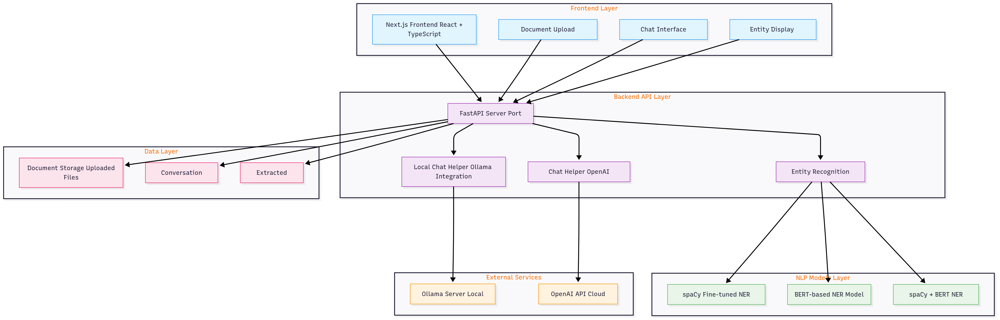

# Lease-Buddy

A comprehensive lease agreement analysis system that uses Natural Language Processing (NLP) to extract key information from lease documents and provides an interactive chat interface for document queries.

## Overview

Lease-Buddy combines multiple NLP models for entity recognition with both cloud-based and local LLM capabilities to help users understand and analyze lease agreements. The system can extract important entities like dates, amounts, parties, and terms from lease documents, and provides an AI chat interface for answering questions about the documents.

## Features

- **Entity Recognition**: Extracts key entities from lease documents including dates, amounts, parties, and lease terms
- **Document Analysis**: Processes uploaded lease agreements to identify important information
- **Interactive Chat**: AI-powered chat interface for asking questions about lease documents
- **Local LLM Support**: Uses Ollama with Phi-3 Mini model for privacy-focused local processing
- **Cloud LLM Support**: OpenAI integration for enhanced capabilities
- **Web Interface**: Modern React/Next.js frontend with real-time chat and document upload

## Architecture




### Backend
- **FastAPI**: RESTful API server
- **spaCy**: Fine-tuned NER model for entity extraction
- **BERT-based Model**: Transformer-based entity recognition
- **Spacy + BERT Model**: Custom model
- **Ollama Integration**: Local LLM server with Phi-3 Mini
- **OpenAI Integration**: Cloud-based LLM for enhanced chat

### Frontend
- **Next.js**: React framework with TypeScript
- **Tailwind CSS**: Modern styling
- **Real-time Chat**: Interactive document query interface
- **Document Upload**: File processing and analysis
- **Entity Display**: Visual representation of extracted information

## Models

1. **[spaCy Fine-tuned Model](./backend/spacy/fine_tuned_NER.ipynb)**: Transfer learning on lease-specific data
2. **[BERT-based Model - LegalBert](./backend/legalBert/fine_tuned_legalBert.ipynb)**: Transformer architecture with token classification
3. **[spaCy + BERT Model](./backend/spacy_legalBert/spacy_legalBert.ipynb)**: Custom model

## Setup

### Prerequisites
- Python 3.9+
- Node.js 18+
- Ollama (for local LLM)

### Installation

1. **Clone the repository**
   ```bash
   git clone <repository-url>
   cd Lease-Buddy
   ```

2. **Backend Setup**
   ```bash
   cd backend
   pip install -r requirements.txt
   ```

3. **Frontend Setup**
   ```bash
   cd frontend/lease-buddy-frontend
   npm install
   ```

4. **Environment Configuration**
   Create `.env` files in backend and frontend directories with:
   - `OPENAI_API_KEY`: For cloud LLM features
   - `OLLAMA_URL`: Local Ollama server (default: http://localhost:11434)
   - `OLLAMA_MODEL`: Ollama model name (default: phi3:mini)

5. **Local LLM Setup (Optional)**
   ```bash
   # Install Ollama
   brew install ollama  # macOS
   # or
   curl -fsSL https://ollama.ai/install.sh | sh  # Linux
   
   # Pull model and start server
   ollama pull phi3:mini
   ollama serve
   ```

## Usage

### Running the Application

1. **Start Backend**
   ```bash
   cd backend
   uvicorn main:app --reload
   ```

2. **Start Frontend**
   ```bash
   cd frontend/lease-buddy-frontend
   npm run dev
   ```

3. **Access Application**
   - Frontend: http://localhost:3000
   - Backend API: http://localhost:8000

### API Endpoints

- `POST /extract-entities`: Extract entities from text
- `POST /chat`: Chat with document using cloud LLM
- `POST /chat/local`: Chat with document using local LLM
- `GET /entity-types`: Get available entity types
- `GET /health`: Health check

## Project Structure

```
Lease-Buddy/
├── backend/                 # FastAPI backend
│   ├── lease_ner_model/    # Trained spaCy model
│   ├── models/             # Training datasets
│   ├── main.py            # API server
│   ├── chat_helper.py     # OpenAI integration
│   └── local_chat_helper.py # Ollama integration
├── frontend/               # Next.js frontend
│   └── lease-buddy-frontend/
│       ├── app/           # Next.js app directory
│       ├── components/    # React components
│       └── public/        # Static assets
└── models/                # Additional model files
```

## Technologies

- **Backend**: Python, FastAPI, spaCy, PyTorch, Ollama
- **Frontend**: Next.js, React, TypeScript, Tailwind CSS
- **ML/AI**: BERT(LegalBERT), spaCy, OpenAI API
- **Infrastructure**: Local LLM (Ollama), Cloud LLM (OpenAI)

## Demo Video

Watch our demo video to see Lease-Buddy in action:

[](https://youtu.be/54ngfQ95vQw?si=rJu5NuB1sTlCbYmJ)
