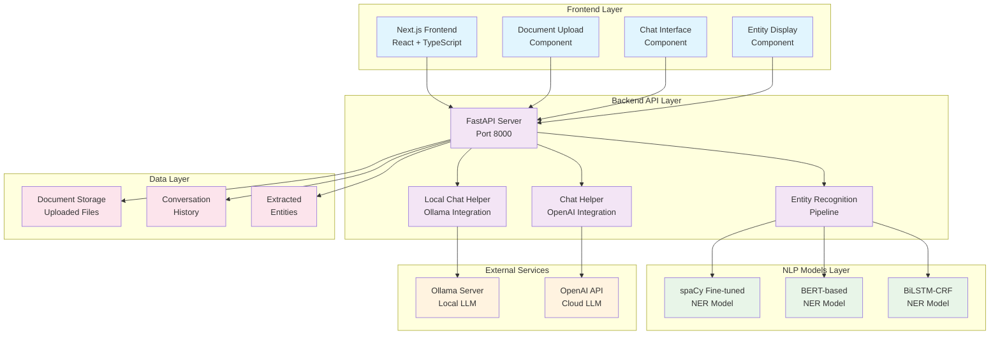
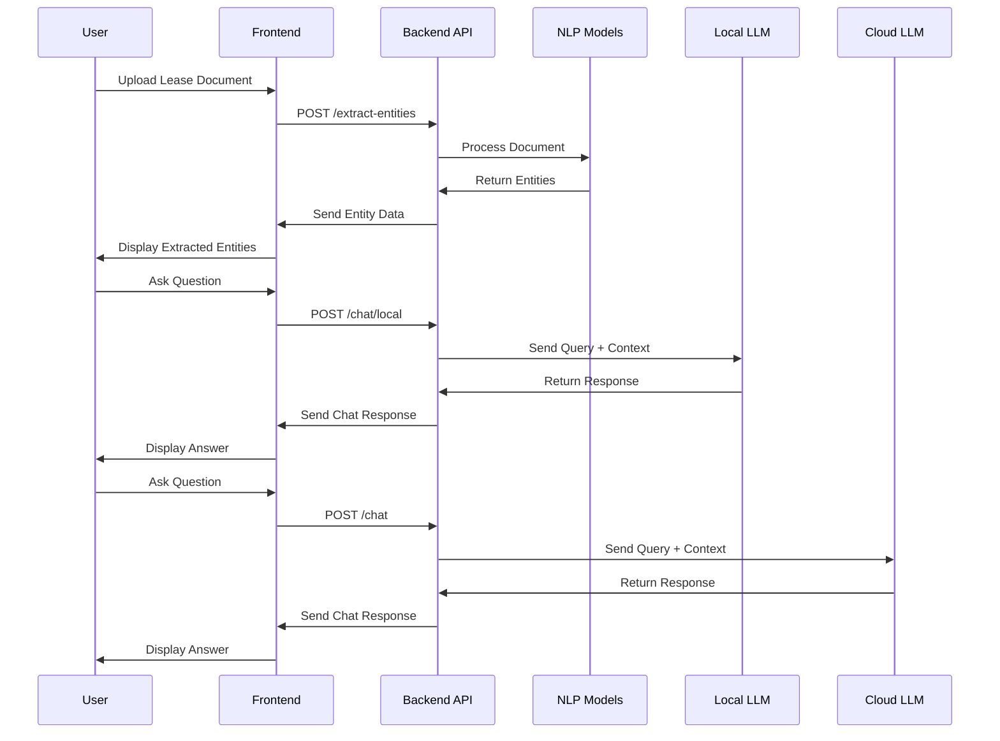
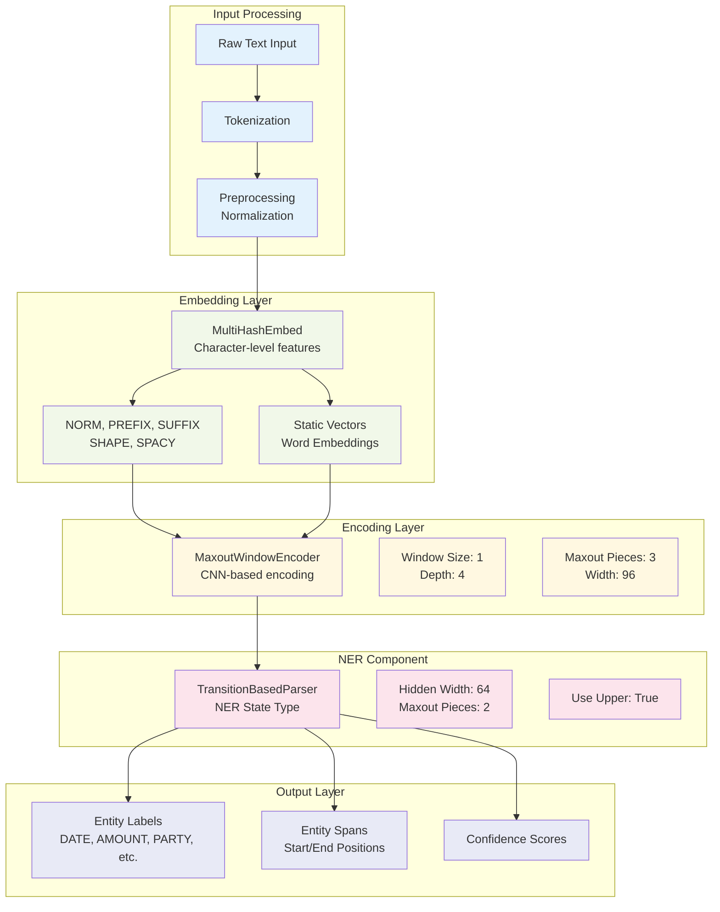
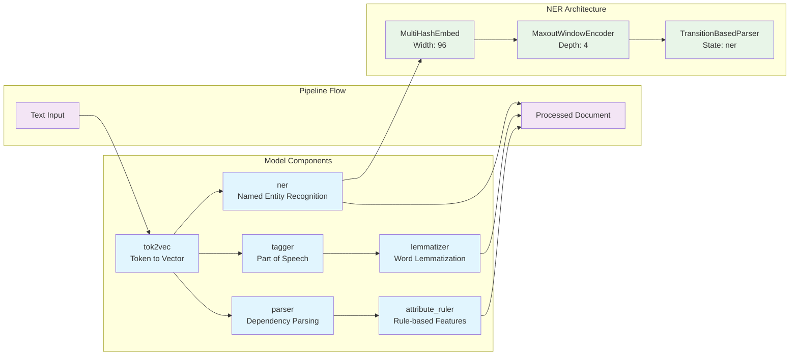
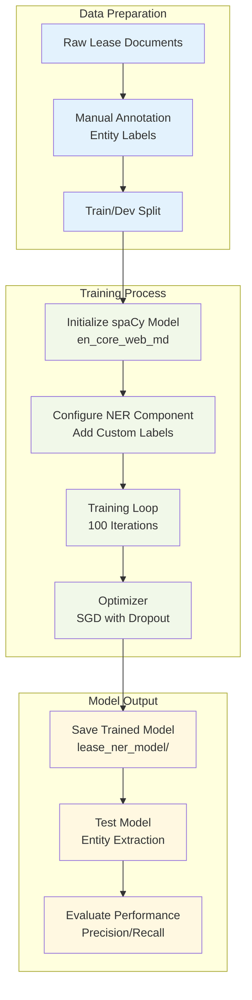
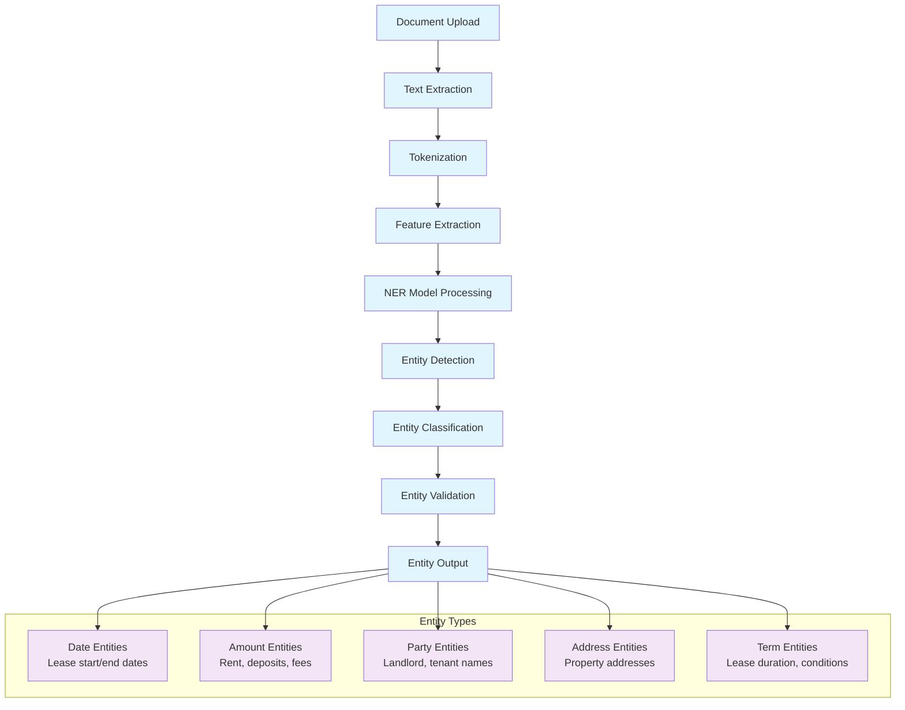
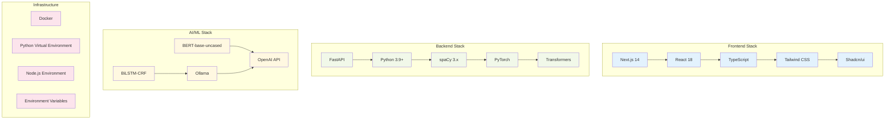

# Lease-Buddy System Architecture

## Overall System Architecture

## Data Flow Architecture

## spaCy NER Model Architecture

## spaCy Model Configuration Details

## Model Training Pipeline

## Entity Recognition Process

## Technology Stack Architecture

